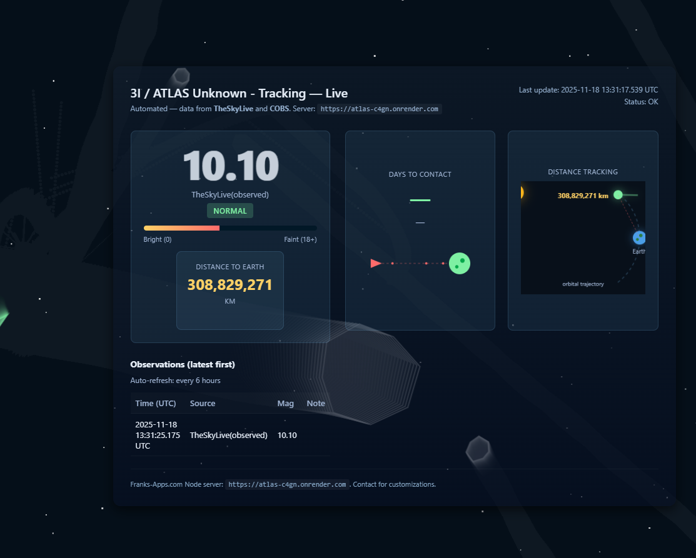

# 3I / ATLAS Tracker / Screen Saver / Asteroid Play



Tongue In Cheek

## Overview
Real-time tracking and visualization system for monitoring Anomoly C/2025 N1 (ATLAS), with live magnitude data, distance calculations, and predicted closest approach dates. The application features an interactive asteroid game visualization running in the background.

## 🌟 Project Purpose

This tracker was developed in response to emerging scientific data about comet C/2025 N1 (ATLAS). The system:
Real-time tracking and visualization system for monitoring Anomoly C/2025 N1 (ATLAS), with live magnitude data, distance calculations, and predicted closest approach dates. The application features an interactive asteroid game visualization running in the background.

## 🌟 Project Purpose

This tracker was developed in response to emerging scientific data about comet C/2025 N1 (ATLAS). The system:

- **Monitors brightness changes** that could indicate unusual activity or composition
- **Tracks distance and velocity** with real-time calculations from TheSkyLive data
- **Calculates closest approach** using actual measured velocity rather than estimates
- **Detects abnormal behavior** when brightness increases unexpectedly (comets typically fade as they recede)
- **Provides historical data** from multiple sources (COBS, TheSkyLive)

## 🔬 Scientific Significance

### Why Monitor This Comet?
Comet C/2025 N1 exhibits characteristics that warrant continuous observation:
- **Interstellar trajectory** (3I designation suggests potential interstellar origin)
- **Brightness variability** tracked across multiple observation networks
- **Distance dynamics** measured in real-time as it moves through the solar system
- **Velocity calculations** updated every 60 seconds for accurate approach predictions

### Data Sources
- **COBS (Comet Observation Database)** - Community-submitted visual observations
- **TheSkyLive** - Automated astronomical calculations and ephemeris data
- **Live Updates** - Automatic refresh every 6 hours for magnitude, every 60 seconds for distance

## 🎮 Features

### Core Tracking
- **Real-time magnitude display** with animated brightness indicator
- **Distance tracking** with km-level precision
- **Days to contact countdown** calculated from actual velocity measurements
- **Contact date projection** with automatic date calculation
- **Acceleration/deceleration detection** based on velocity changes
- **Historical observations table** showing latest data first

### Visual Features
- **Background asteroid game** with autonomous AI-controlled spaceship
- **Interactive canvas overlay** (transparent, non-intrusive)
- **Large asteroid events** spawning every ~14 seconds
- **UFO encounters** with targeting systems and combat
- **Hyperspace mechanics** for emergency evasion
- **Collision detection** and particle effects

### Security & Performance
- **Rate limiting** (60 requests/minute per IP)
- **Input validation** for all external data
- **XSS protection** with safe DOM manipulation
- **Security headers** (X-Frame-Options, CSP, etc.)
- **Data sanitization** for scraped content
- **Error handling** with graceful degradation

## 🚀 Technology Stack

### Frontend
- Vanilla JavaScript with Canvas API
- Real-time data visualization
- Autonomous game AI
- Responsive CSS Grid layout

### Backend
- Node.js with Express
- Cheerio for web scraping
- CORS-enabled API
- In-memory caching system
- Background refresh jobs

## 📊 Data Calculations

### Velocity Tracking
```javascript
// Uses multiple distance measurements over time
velocity = (distance_old - distance_new) / time_elapsed
// Filtered for accuracy (1-200 km/s range)
// Updates every 60 seconds
```

### Contact Date Prediction
```javascript
// Based on current distance and measured velocity
seconds_to_contact = current_distance / velocity
contact_date = today + (seconds_to_contact / 86400) days
```

### Abnormal Brightness Detection
```javascript
// Comets should fade (higher magnitude) as they recede
magnitude_change = previous_mag - current_mag
status = (magnitude_change > 0.3) ? "abnormal" : "normal"
```

## 🔧 Setup & Installation

### Prerequisites
- Node.js 18+ (for native fetch support)
- npm or yarn

### Installation
```bash
npm install
```

### Run Development Server
```bash
node server.js
```

Server runs on `http://localhost:3000` (or PORT environment variable)

### Environment Variables
```bash
REFRESH_INTERVAL_HOURS=6  # Magnitude data refresh interval
PORT=3000                  # Server port
```

## 📡 API Endpoints

### `/api/latest`
Returns cached magnitude and observation data
- Auto-refreshes every 6 hours
- Includes source attribution (COBS/TheSkyLive)
- Provides brightness status (normal/abnormal)

### `/api/distance`
Returns real-time distance to Earth in kilometers
- Refreshes every 60 seconds on server
- Calculated from TheSkyLive ephemeris

### `/api/test`
Health check endpoint

### `/api/theskylive`
Direct scraping endpoint for diagnostic purposes

### `/api/cobs`
Direct scraping endpoint for COBS data

## 🎯 Game Mechanics

The background asteroid game features:
- **AI-controlled ship** that tracks and destroys asteroids
- **Autonomous targeting** system with smooth rotation
- **Bullet firing** when locked onto targets
- **Large asteroids** (80-120px) entering periodically
- **UFO encounters** that fire at the ship
- **Hyperspace jumps** activated in dangerous situations (8s cooldown)
- **Collision detection** between ship and large asteroids
- **3-second respawn** after ship destruction
- **Particle effects** for explosions and hyperspace

## 🛡️ Security Features

- Rate limiting (60 req/min per IP)
- Input validation (magnitude: 0-30, distance: < 1 trillion km)
- XSS protection via `textContent` instead of `innerHTML`
- Security headers (X-Frame-Options, X-XSS-Protection, etc.)
- JSON payload size limits (10KB)
- Error boundary handling
- Data type coercion and sanitization

## 📈 Performance

- **Client polling**: Every 6 hours for magnitude data
- **Distance updates**: Every 60 seconds (server-side)
- **Display interpolation**: Every 1 second for smooth distance countdown
- **Rate limit cleanup**: Every 60 seconds
- **Canvas rendering**: 60 FPS via requestAnimationFrame

## 🌐 Deployment

Designed for Render deployment with:
- Static file serving
- Background refresh jobs
- CORS enabled for cross-origin access
- Automatic HTTPS on production

Production URL: `https://atlas-c4gn.onrender.com`

## 📝 License

MIT License - Feel free to use for scientific research and education

## 🤝 Contributing

Contributions welcome for:
- Additional data sources
- Enhanced visualization features
- Performance optimizations
- Scientific analysis tools

## 📞 Contact

For scientific collaboration or technical inquiries, please open an issue on GitHub.

---

**Note**: This tracker is for educational and scientific observation purposes. All astronomical data is sourced from public observation networks and calculated ephemerides.
